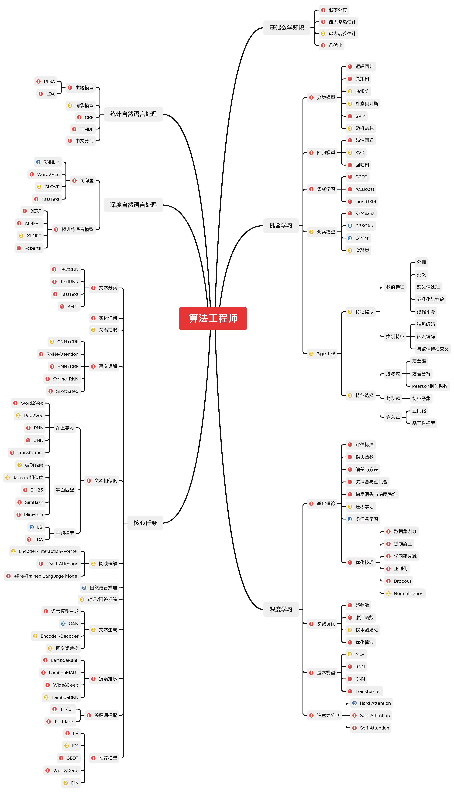

# 自然语言工程师技术目录及实例
## 目录
```
D:.
├───.idea
│   └───inspectionProfiles
├───DeepLearning_Natural_Language_Processing
│   ├───Fasttext
│   │   ├───THUCNews
│   │   │   ├───checkpoints
│   │   │   ├───data
│   │   │   └───log
│   │   │       └───FastText
│   │   │           ├───05-02_10.35
│   │   │           ├───05-02_10.37
│   │   │           ├───05-02_10.39
│   │   │           ├───05-02_10.42
│   │   │           ├───05-02_10.51
│   │   │           └───05-02_10.53
│   │   └───__pycache__
│   ├───glove
│   └───Word2Vec
├───Keyword Extract
├───Relation Extract
│   ├───models_real
│   └───__pycache__
├───Search Rank
│   ├───ckptdir
│   ├───MSLR-WEB10K
│   │   ├───Fold1
│   │   ├───Fold2
│   │   ├───Fold3
│   │   ├───Fold4
│   │   └───Fold5
│   └───__pycache__
├───Statistical_Natural_Language_Processing
│   ├───LDA
│   │   ├───.idea
│   │   │   └───inspectionProfiles
│   │   ├───data
│   │   └───__pycache__
│   └───TF-IDF
├───Text Classification
│   ├───models
│   │   └───__pycache__
│   ├───pretrained_model
│   ├───THUCNews
│   │   ├───data
│   │   └───saved_dict
│   └───__pycache__
└───Text Similarity
    └───bm25
        └───document
```
统计自然语言处理\
深度自然语言处理\
文本分类\
关系抽取

